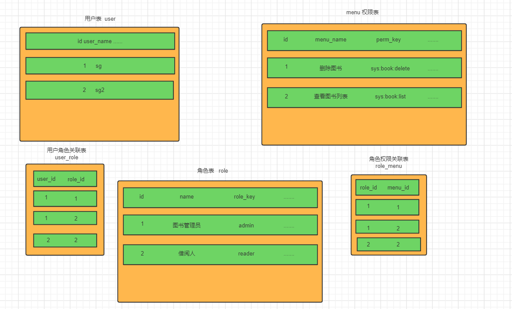
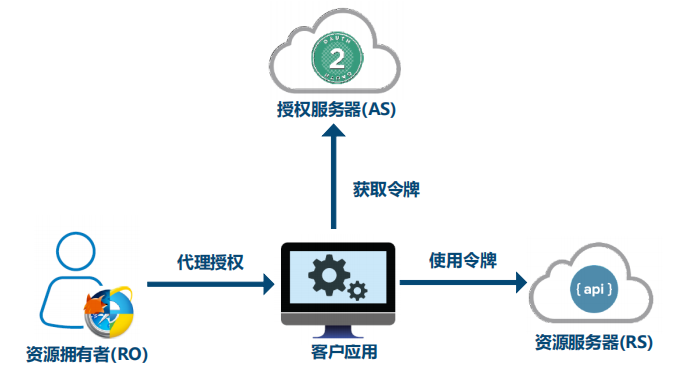
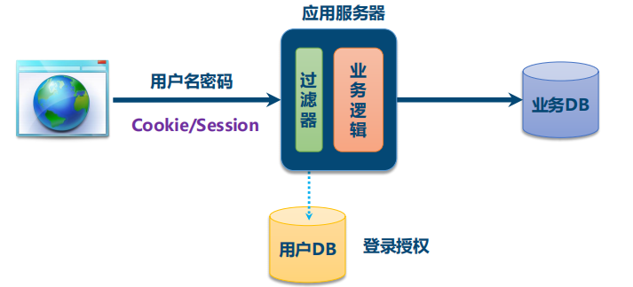
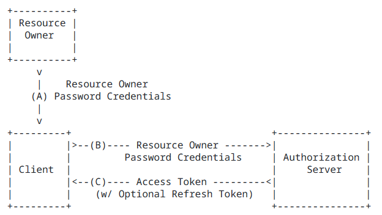

### 执行流程

* 首先在 SpringSecurity 中放行登录接口。

* 执行登录具体功能

```java
// 使用authenticationManager进行用户验证
// authenticationManager.authenticate()
UsernamePasswordAuthenticationToken usernamePasswordAuthenticationToken =
        new UsernamePasswordAuthenticationToken(username, password);

Authentication authenticate = authenticationManager.authenticate(usernamePasswordAuthenticationToken);
```

* 执行上面的代码的过程中由  **UserDetailsServiceImpl** 得到用户信息和权限信息

```java
@Service
public class UserDetailsServiceImpl implements UserDetailsService {

    @Resource
    private UserMapper userMapper;

    @Resource
    private CommunityManageMapper communityManageMapper;
    @Resource
    private CommunityManageMenuConnectMapper communityManageMenuConnectMapper;
    @Resource
    private CommunityManageMenuMapper communityManageMenuMapper;


    /**
     * 查询用户信息
     * 查询授权信息
     *
     * @param username 用户名
     * @return {@link null}
     * @author wusihao
     * @date 2023/11/19 16:21
     */
    @Override
    public UserDetails loadUserByUsername(String username) throws UsernameNotFoundException {
        LambdaQueryWrapper<User> userLambdaQueryWrapper = new LambdaQueryWrapper<>();
        userLambdaQueryWrapper.eq(User::getUsername, username);
        User user = userMapper.selectOne(userLambdaQueryWrapper);

        if (user == null) {
            throw new MonkeyBlogException(ExceptionEnum.USER_NOT_EXIST.getCode(), ExceptionEnum.USER_NOT_EXIST.getMsg());
        }
        // 得到社区管理用户授权信息
        Long userId = user.getId();
        List<String> communityUserMenu = this.getCommunityUserAuthority(userId);

        return new UserDetailsImpl(user, communityUserMenu);
    }

    /**
     * 得到社区管理用户授权信息
     *
     * @return {@link null}
     * @author wusihao
     * @date 2023/11/22 9:37
     */
    private List<String> getCommunityUserAuthority(Long userId) {
        // 查找用户管理集合
        LambdaQueryWrapper<CommunityManage> communityManageLambdaQueryWrapper = new LambdaQueryWrapper<>();
        communityManageLambdaQueryWrapper.eq(CommunityManage::getUserId, userId);
        communityManageLambdaQueryWrapper.eq(CommunityManage::getStatus, CommunityMenuEnum.STATUS_NORMAL.getCode());
        communityManageLambdaQueryWrapper.select(CommunityManage::getId, CommunityManage::getManageKey);
        List<CommunityManage> communityManageList = communityManageMapper.selectList(communityManageLambdaQueryWrapper);

        if (communityManageList == null || communityManageList.size() <= 0) {
            return new ArrayList<>();
        }
        // 查找社区用户管理权限集合
        List<Long> communityManageIdList = communityManageList.stream().mapToLong(CommunityManage::getId).boxed().collect(Collectors.toList());
        LambdaQueryWrapper<CommunityManageMenuConnect> communityManageMenuConnectLambdaQueryWrapper = new LambdaQueryWrapper<>();
        communityManageMenuConnectLambdaQueryWrapper.in(CommunityManageMenuConnect::getCommunityManageId, communityManageIdList);
        communityManageMenuConnectLambdaQueryWrapper.select(CommunityManageMenuConnect::getCommunityManageMenuId);
        List<Object> communityManageMenuIdList = communityManageMenuConnectMapper.selectObjs(communityManageMenuConnectLambdaQueryWrapper);

        LambdaQueryWrapper<CommunityManageMenu> communityManageMenuLambdaQueryWrapper = new LambdaQueryWrapper<>();
        communityManageMenuLambdaQueryWrapper.in(CommunityManageMenu::getId, communityManageMenuIdList);
        communityManageMenuLambdaQueryWrapper.select(CommunityManageMenu::getPerms);
        List<CommunityManageMenu> communityManageMenuList = communityManageMenuMapper.selectList(communityManageMenuLambdaQueryWrapper);

        List<String> permsList = communityManageMenuList
                .stream()
                .map(CommunityManageMenu::getPerms)
                .distinct()
                .collect(Collectors.toList());

        communityManageList.stream().forEach(f -> permsList.add(f.getManageKey()));
        return permsList;
    }
}
```

* 封装用户信息和权限信息

```java
/*
 * 通过从数据库中查到的用户名和密码判断该用户是否合格
 * */
@Data
@NoArgsConstructor
public class UserDetailsImpl implements UserDetails {

    private User user;

    // 用户权限集合
    private List<String> permissions;

    // 转化后的集合，防止每次执行此方法的时候都进行转化
    // 此注解的作用是防止redis序列化，
    // 最后要将UserDetailsImpl存入redis中
    // 因为它不属于java pojo中的类，序列化可能存在问题，防止运行时异常
    @JSONField(serialize = false)
    List<SimpleGrantedAuthority> authorities;
    /**
     * 获取权限信息
     *
     * @return {@link null}
     * @author wusihao
     * @date 2023/11/19 16:27
     */
    @Override
    public Collection<? extends GrantedAuthority> getAuthorities() {
        // 把permissions中的String类型的权限信息封装成SimpleGrantedAuthority返回
        if (authorities == null) {
            authorities = this.permissions
                    .stream()
                    .map(SimpleGrantedAuthority::new)
                    .collect(Collectors.toList());
        }

        return authorities;
    }

    public User getUser() {
        return user;
    }

    public void setUser(User user) {
        this.user = user;
    }

    @Override
    public String getPassword() {
        return user.getPassword();
    }

    @Override
    public String getUsername() {
        return user.getUsername();
    }

    @Override
    public boolean isAccountNonExpired() {
        return true;
    }

    @Override
    public boolean isAccountNonLocked() {
        return true;
    }

    @Override
    public boolean isCredentialsNonExpired() {
        return true;
    }

    @Override
    public boolean isEnabled() {
        return true;
    }

    public UserDetailsImpl(User user, List<String> permissions) {
        this.user = user;
        this.permissions = permissions;
    }
}

```


* 将获取到的用户信息和权限信息存入 Redis

```java
@Override
    public ResultVO loginUsername(String username, String password, String verifyCode) {
        if (verifyCode == null || "".equals(verifyCode)) {
            return new ResultVO(ResultStatus.NO, "验证码不能为空", null);
        }
        if (!verifyCode.equals(this.lineCaptcha.getCode())) {
            return new ResultVO(ResultStatus.NO, "验证码输入错误，请重新输入", null);
        }

        // 使用authenticationManager进行用户验证
        // authenticationManager.authenticate()
        UsernamePasswordAuthenticationToken usernamePasswordAuthenticationToken =
                new UsernamePasswordAuthenticationToken(username, password);

        Authentication authenticate = authenticationManager.authenticate(usernamePasswordAuthenticationToken);

        // 执行到此处说明认证通过了
        UserDetailsImpl userDetails = (UserDetailsImpl)authenticate.getPrincipal();
        User user = userDetails.getUser();

        if (user == null) {
            return new ResultVO(ResultStatus.NO, "用户名不存在，请重新输入", null);
        } else {
            String authPassword = user.getPassword();
            if (!passwordEncoder.matches(password, authPassword)) {
                return new ResultVO(ResultStatus.NO, "密码错误，请重新输入", null);
            }
        }

        user.setPhone(null);
        user.setPassword(null);
        user.setEmail(null);
        String token = JwtUtil.createJWT(user.getId().toString());
        // 将用户信息存入redis
        String redisKey = RedisKeyAndTimeEnum.USER_INFO.getKeyName() + user.getId();
        stringRedisTemplate.opsForValue().set(redisKey, JSONObject.toJSONString(userDetails));
        return new ResultVO(ResultStatus.OK, "登录成功", token);
    }
```

* 等到用户再次登录时就不需要查询数据库，而是直接从 Redis 里面获取用户权限信息存入权限校验

```java
@Component
public class JwtAuthenticationTokenFilter extends OncePerRequestFilter {
    @Resource
    private UserMapper userMapper;

    @Resource
    private UserDetailsService userDetailsService;

    @Resource
    private StringRedisTemplate stringRedisTemplate;
    @Override
    protected void doFilterInternal(HttpServletRequest request, @NotNull HttpServletResponse response, @NotNull FilterChain filterChain) throws ServletException, IOException {
        // 从哪里读取token
        String token = request.getHeader("Authorization");
        // token以Bearer开头
        if (!StringUtils.hasText(token) || !token.startsWith("Bearer ")) {
            // 若不存在token, 直接放行，不将用户信息存入getContext中
            // 让后续过滤器判断该用户是否是认证状态
            filterChain.doFilter(request, response);
            // 加上return 是防止后面过滤器解析完之后再次执行解析token的操作
            return;
        }
        token = token.substring(7);

        String userId;
        try {
            Claims claims = JwtUtil.parseJWT(token);
            userId = claims.getSubject();
        } catch (Exception e) {
            throw new MonkeyBlogException(ExceptionEnum.TOKEN_ERROR.getCode(), ExceptionEnum.TOKEN_ERROR.getMsg());
        }

        // 解析完token后得到用户信息
        String redisKey = RedisKeyAndTimeEnum.USER_INFO.getKeyName() + userId;
        String userStr = stringRedisTemplate.opsForValue().get(redisKey);
        UserDetailsImpl userDetails  = JSONObject.parseObject(userStr, UserDetailsImpl.class);
        if (userDetails == null) {
            throw new MonkeyBlogException(ExceptionEnum.USER_NOT_EXIST.getCode(), ExceptionEnum.USER_NOT_EXIST.getMsg());
        }

        // 获取权限信息封装到authenticationToken中
        UsernamePasswordAuthenticationToken authenticationToken =
                new UsernamePasswordAuthenticationToken(userDetails, null, userDetails.getAuthorities());

        // 因为后面的过滤器都要从此方法中获得用户信息，所以要将用户信息存在此处
        SecurityContextHolder.getContext().setAuthentication(authenticationToken);

        filterChain.doFilter(request, response);
    }
}
```

### 核心代码实现

创建一个类实现UserDetailsService接口，重写其中的方法。更加用户名从数据库中查询用户信息

```java
@Service
public class UserDetailsServiceImpl implements UserDetailsService {
 
    @Autowired
    private UserMapper userMapper;
 
    @Override
    public UserDetails loadUserByUsername(String username) throws UsernameNotFoundException {
        //根据用户名查询用户信息
        LambdaQueryWrapper<User> wrapper = new LambdaQueryWrapper<>();
        wrapper.eq(User::getUserName,username);
        User user = userMapper.selectOne(wrapper);
        //如果查询不到数据就通过抛出异常来给出提示
        if(Objects.isNull(user)){
            throw new RuntimeException("用户名或密码错误");
        }
        //TODO 根据用户查询权限信息 添加到LoginUser中
        
        //封装成UserDetails对象返回 
        return new LoginUser(user);
    }
}
```

因为UserDetailsService方法的返回值是UserDetails类型，所以需要定义一个类，实现该接口，把用户信息封装在其中

```java

@Data
@NoArgsConstructor
@AllArgsConstructor
public class LoginUser implements UserDetails {
 
    private User user;
 
 
    @Override
    public Collection<? extends GrantedAuthority> getAuthorities() {
        return null;
    }
 
    @Override
    public String getPassword() {
        return user.getPassword();
    }
 
    @Override
    public String getUsername() {
        return user.getUserName();
    }
 
    @Override
    public boolean isAccountNonExpired() {
        return true;
    }
 
    @Override
    public boolean isAccountNonLocked() {
        return true;
    }
 
    @Override
    public boolean isCredentialsNonExpired() {
        return true;
    }
 
    @Override
    public boolean isEnabled() {
        return true;
    }
}
```

注意：如果要测试，需要往用户表中写入用户数据，并且如果你想让用户的密码是明文存储，需要在密码前加{noop}。

这样登陆的时候就可以用sg作为用户名，1234作为密码来登陆了。

##### 密码加密存储

 实际项目中我们不会把密码明文存储在数据库中。

 默认使用的PasswordEncoder要求数据库中的密码格式为：{id}password 。它会根据id去判断密码的加密方式。但是我们一般不会采用这种方式。所以就需要替换PasswordEncoder。

 我们一般使用SpringSecurity为我们提供的BCryptPasswordEncoder。

 我们只需要使用把BCryptPasswordEncoder对象注入Spring容器中，SpringSecurity就会使用该PasswordEncoder来进行密码校验。

 我们可以定义一个SpringSecurity的配置类，SpringSecurity要求这个配置类要继承WebSecurityConfigurerAdapter。

```java
@Configuration
public class SecurityConfig extends WebSecurityConfigurerAdapter {
 
 
    @Bean
    public PasswordEncoder passwordEncoder(){
        return new BCryptPasswordEncoder();
    }
 
}
```

##### 登陆接口

 接下我们需要自定义登陆接口，然后让SpringSecurity对这个接口放行,让用户访问这个接口的时候不用登录也能访问。

 在接口中我们通过AuthenticationManager的authenticate方法来进行用户认证,所以需要在SecurityConfig中配置把AuthenticationManager注入容器。

 认证成功的话要生成一个jwt，放入响应中返回。并且为了让用户下回请求时能通过jwt识别出具体的是哪个用户，我们需要把用户信息存入redis，可以把用户id作为key。

```java
@RestController
public class LoginController {
 
    @Autowired
    private LoginServcie loginServcie;
 
    @PostMapping("/user/login")
    public ResponseResult login(@RequestBody User user){
        return loginServcie.login(user);
    }
}
```

```java
@Configuration
public class SecurityConfig extends WebSecurityConfigurerAdapter {
 
 
    @Bean
    public PasswordEncoder passwordEncoder(){
        return new BCryptPasswordEncoder();
    }
 
    @Override
    protected void configure(HttpSecurity http) throws Exception {
        http
                //关闭csrf
                .csrf().disable()
                //不通过Session获取SecurityContext
                .sessionManagement().sessionCreationPolicy(SessionCreationPolicy.STATELESS)
                .and()
                .authorizeRequests()
                // 对于登录接口 允许匿名访问
                .antMatchers("/user/login").anonymous()
                // 除上面外的所有请求全部需要鉴权认证
                .anyRequest().authenticated();
    }
 
    @Bean
    @Override
    public AuthenticationManager authenticationManagerBean() throws Exception {
        return super.authenticationManagerBean();
    }
}
```


```java
@Service
public class LoginServiceImpl implements LoginServcie {
 
    @Autowired
    private AuthenticationManager authenticationManager;
    @Autowired
    private RedisCache redisCache;
 
    @Override
    public ResponseResult login(User user) {
        UsernamePasswordAuthenticationToken authenticationToken = new UsernamePasswordAuthenticationToken(user.getUserName(),user.getPassword());
        Authentication authenticate = authenticationManager.authenticate(authenticationToken);
        if(Objects.isNull(authenticate)){
            throw new RuntimeException("用户名或密码错误");
        }
        //使用userid生成token
        LoginUser loginUser = (LoginUser) authenticate.getPrincipal();
        String userId = loginUser.getUser().getId().toString();
        String jwt = JwtUtil.createJWT(userId);
        //authenticate存入redis
        redisCache.setCacheObject("login:"+userId,loginUser);
        //把token响应给前端
        HashMap<String,String> map = new HashMap<>();
        map.put("token",jwt);
        return new ResponseResult(200,"登陆成功",map);
    }
}
```

##### 认证过滤器

 我们需要自定义一个过滤器，这个过滤器会去获取请求头中的token，对token进行解析取出其中的userid。

 使用userid去redis中获取对应的LoginUser对象。

 然后封装Authentication对象存入SecurityContextHolder

```java
@Component
public class JwtAuthenticationTokenFilter extends OncePerRequestFilter {
 
    @Autowired
    private RedisCache redisCache;
 
    @Override
    protected void doFilterInternal(HttpServletRequest request, HttpServletResponse response, FilterChain filterChain) throws ServletException, IOException {
        //获取token
        String token = request.getHeader("token");
        if (!StringUtils.hasText(token)) {
            //放行
            filterChain.doFilter(request, response);
            return;
        }
        //解析token
        String userid;
        try {
            Claims claims = JwtUtil.parseJWT(token);
            userid = claims.getSubject();
        } catch (Exception e) {
            e.printStackTrace();
            throw new RuntimeException("token非法");
        }
        //从redis中获取用户信息
        String redisKey = "login:" + userid;
        LoginUser loginUser = redisCache.getCacheObject(redisKey);
        if(Objects.isNull(loginUser)){
            throw new RuntimeException("用户未登录");
        }
        //存入SecurityContextHolder
        //TODO 获取权限信息封装到Authentication中
        UsernamePasswordAuthenticationToken authenticationToken =
                new UsernamePasswordAuthenticationToken(loginUser,null,null);
        SecurityContextHolder.getContext().setAuthentication(authenticationToken);
        //放行
        filterChain.doFilter(request, response);
    }
}
```

```java

@Configuration
public class SecurityConfig extends WebSecurityConfigurerAdapter {
 
 
    @Bean
    public PasswordEncoder passwordEncoder(){
        return new BCryptPasswordEncoder();
    }
 
 
    @Autowired
    JwtAuthenticationTokenFilter jwtAuthenticationTokenFilter;
 
    @Override
    protected void configure(HttpSecurity http) throws Exception {
        http
                //关闭csrf
                .csrf().disable()
                //不通过Session获取SecurityContext
                .sessionManagement().sessionCreationPolicy(SessionCreationPolicy.STATELESS)
                .and()
                .authorizeRequests()
                // 对于登录接口 允许匿名访问
                .antMatchers("/user/login").anonymous()
                // 除上面外的所有请求全部需要鉴权认证
                .anyRequest().authenticated();
 
        //把token校验过滤器添加到过滤器链中
        http.addFilterBefore(jwtAuthenticationTokenFilter, UsernamePasswordAuthenticationFilter.class);
    }
 
    @Bean
    @Override
    public AuthenticationManager authenticationManagerBean() throws Exception {
        return super.authenticationManagerBean();
    }
}
```

##### 退出登陆

 我们只需要定义一个登陆接口，然后获取SecurityContextHolder中的认证信息，删除redis中对应的数据即可。

```java
@Service
public class LoginServiceImpl implements LoginServcie {
 
    @Autowired
    private AuthenticationManager authenticationManager;
    @Autowired
    private RedisCache redisCache;
 
    @Override
    public ResponseResult login(User user) {
        UsernamePasswordAuthenticationToken authenticationToken = new UsernamePasswordAuthenticationToken(user.getUserName(),user.getPassword());
        Authentication authenticate = authenticationManager.authenticate(authenticationToken);
        if(Objects.isNull(authenticate)){
            throw new RuntimeException("用户名或密码错误");
        }
        //使用userid生成token
        LoginUser loginUser = (LoginUser) authenticate.getPrincipal();
        String userId = loginUser.getUser().getId().toString();
        String jwt = JwtUtil.createJWT(userId);
        //authenticate存入redis
        redisCache.setCacheObject("login:"+userId,loginUser);
        //把token响应给前端
        HashMap<String,String> map = new HashMap<>();
        map.put("token",jwt);
        return new ResponseResult(200,"登陆成功",map);
    }
 
    @Override
    public ResponseResult logout() {
        Authentication authentication = SecurityContextHolder.getContext().getAuthentication();
        LoginUser loginUser = (LoginUser) authentication.getPrincipal();
        Long userid = loginUser.getUser().getId();
        redisCache.deleteObject("login:"+userid);
        return new ResponseResult(200,"退出成功");
    }
}
```

###  授权基本流程

 在SpringSecurity中，会使用默认的FilterSecurityInterceptor来进行权限校验。在FilterSecurityInterceptor中会从SecurityContextHolder获取其中的Authentication，然后获取其中的权限信息。当前用户是否拥有访问当前资源所需的权限。

 所以我们在项目中只需要把当前登录用户的权限信息也存入Authentication。

 然后设置我们的资源所需要的权限即可。

#### 授权实现

#### 限制访问资源所需权限

 SpringSecurity为我们提供了基于注解的权限控制方案，这也是我们项目中主要采用的方式。我们可以使用注解去指定访问对应的资源所需的权限。

 但是要使用它我们需要先开启相关配置。

java

```java
@EnableGlobalMethodSecurity(prePostEnabled = true)
```

 然后就可以使用对应的注解。@PreAuthorize

java

```java
@RestController
public class HelloController {
 
    @RequestMapping("/hello")
    @PreAuthorize("hasAuthority('test')")
    public String hello(){
        return "hello";
    }
}
```

#### 封装权限信息

 我们前面在写UserDetailsServiceImpl的时候说过，在查询出用户后还要获取对应的权限信息，封装到UserDetails中返回。

 我们先直接把权限信息写死封装到UserDetails中进行测试。

 我们之前定义了UserDetails的实现类LoginUser，想要让其能封装权限信息就要对其进行修改。

```java
@Data
@NoArgsConstructor
public class LoginUser implements UserDetails {
 
    private User user;
        
    //存储权限信息
    private List<String> permissions;
    
    
    public LoginUser(User user,List<String> permissions) {
        this.user = user;
        this.permissions = permissions;
    }
 
 
    //存储SpringSecurity所需要的权限信息的集合
    @JSONField(serialize = false)
    private List<GrantedAuthority> authorities;
 
    @Override
    public  Collection<? extends GrantedAuthority> getAuthorities() {
        if(authorities!=null){
            return authorities;
        }
        //把permissions中字符串类型的权限信息转换成GrantedAuthority对象存入authorities中
        authorities = permissions.stream().
                map(SimpleGrantedAuthority::new)
                .collect(Collectors.toList());
        return authorities;
    }
 
    @Override
    public String getPassword() {
        return user.getPassword();
    }
 
    @Override
    public String getUsername() {
        return user.getUserName();
    }
 
    @Override
    public boolean isAccountNonExpired() {
        return true;
    }
 
    @Override
    public boolean isAccountNonLocked() {
        return true;
    }
 
    @Override
    public boolean isCredentialsNonExpired() {
        return true;
    }
 
    @Override
    public boolean isEnabled() {
        return true;
    }
}
```

 LoginUser修改完后我们就可以在UserDetailsServiceImpl中去把权限信息封装到LoginUser中了。我们写死权限进行测试，后面我们再从数据库中查询权限信息。

java

```java
package com.sangeng.service.impl;
 
import com.baomidou.mybatisplus.core.conditions.query.LambdaQueryWrapper;
import com.baomidou.mybatisplus.core.conditions.query.QueryWrapper;
import com.baomidou.mybatisplus.extension.conditions.query.LambdaQueryChainWrapper;
import com.sangeng.domain.LoginUser;
import com.sangeng.domain.User;
import com.sangeng.mapper.UserMapper;
import org.springframework.beans.factory.annotation.Autowired;
import org.springframework.security.core.userdetails.UserDetails;
import org.springframework.security.core.userdetails.UserDetailsService;
import org.springframework.security.core.userdetails.UsernameNotFoundException;
import org.springframework.stereotype.Service;
 
import java.util.ArrayList;
import java.util.Arrays;
import java.util.List;
import java.util.Objects;
 

@Service
public class UserDetailsServiceImpl implements UserDetailsService {
 
    @Autowired
    private UserMapper userMapper;
 
    @Override
    public UserDetails loadUserByUsername(String username) throws UsernameNotFoundException {
        LambdaQueryWrapper<User> wrapper = new LambdaQueryWrapper<>();
        wrapper.eq(User::getUserName,username);
        User user = userMapper.selectOne(wrapper);
        if(Objects.isNull(user)){
            throw new RuntimeException("用户名或密码错误");
        }
        //TODO 根据用户查询权限信息 添加到LoginUser中
        List<String> list = new ArrayList<>(Arrays.asList("test"));
        return new LoginUser(user,list);
    }
}
```

#### 从数据库查询权限信息


##### RBAC权限模型


RBAC权限模型（Role-Based Access Control）即：基于角色的权限控制。这是目前最常被开发者使用也是相对易用、通用权限模型。

[](https://camo.githubusercontent.com/1957f20a6bd79f4d6700e5a332e0118fa59052a7c09427ab91cc63c88c533e6e/68747470733a2f2f696d67323032322e636e626c6f67732e636f6d2f626c6f672f323930393831342f3230323230382f323930393831342d32303232303831353137313531333538302d39393638323932342e706e67)

##### 准备工作


sql

```sql
CREATE DATABASE /*!32312 IF NOT EXISTS*/`sg_security` /*!40100 DEFAULT CHARACTER SET utf8mb4 */;
 
USE `sg_security`;
 
/*Table structure for table `sys_menu` */
 
DROP TABLE IF EXISTS `sys_menu`;
 
CREATE TABLE `sys_menu` (
  `id` bigint(20) NOT NULL AUTO_INCREMENT,
  `menu_name` varchar(64) NOT NULL DEFAULT 'NULL' COMMENT '菜单名',
  `path` varchar(200) DEFAULT NULL COMMENT '路由地址',
  `component` varchar(255) DEFAULT NULL COMMENT '组件路径',
  `visible` char(1) DEFAULT '0' COMMENT '菜单状态（0显示 1隐藏）',
  `status` char(1) DEFAULT '0' COMMENT '菜单状态（0正常 1停用）',
  `perms` varchar(100) DEFAULT NULL COMMENT '权限标识',
  `icon` varchar(100) DEFAULT '#' COMMENT '菜单图标',
  `create_by` bigint(20) DEFAULT NULL,
  `create_time` datetime DEFAULT NULL,
  `update_by` bigint(20) DEFAULT NULL,
  `update_time` datetime DEFAULT NULL,
  `del_flag` int(11) DEFAULT '0' COMMENT '是否删除（0未删除 1已删除）',
  `remark` varchar(500) DEFAULT NULL COMMENT '备注',
  PRIMARY KEY (`id`)
) ENGINE=InnoDB AUTO_INCREMENT=2 DEFAULT CHARSET=utf8 COMMENT='菜单表';
 
/*Table structure for table `sys_role` */
 
DROP TABLE IF EXISTS `sys_role`;
 
CREATE TABLE `sys_role` (
  `id` bigint(20) NOT NULL AUTO_INCREMENT,
  `name` varchar(128) DEFAULT NULL,
  `role_key` varchar(100) DEFAULT NULL COMMENT '角色权限字符串',
  `status` char(1) DEFAULT '0' COMMENT '角色状态（0正常 1停用）',
  `del_flag` int(1) DEFAULT '0' COMMENT 'del_flag',
  `create_by` bigint(200) DEFAULT NULL,
  `create_time` datetime DEFAULT NULL,
  `update_by` bigint(200) DEFAULT NULL,
  `update_time` datetime DEFAULT NULL,
  `remark` varchar(500) DEFAULT NULL COMMENT '备注',
  PRIMARY KEY (`id`)
) ENGINE=InnoDB AUTO_INCREMENT=3 DEFAULT CHARSET=utf8 COMMENT='角色表';
 
/*Table structure for table `sys_role_menu` */
 
DROP TABLE IF EXISTS `sys_role_menu`;
 
CREATE TABLE `sys_role_menu` (
  `role_id` bigint(200) NOT NULL AUTO_INCREMENT COMMENT '角色ID',
  `menu_id` bigint(200) NOT NULL DEFAULT '0' COMMENT '菜单id',
  PRIMARY KEY (`role_id`,`menu_id`)
) ENGINE=InnoDB AUTO_INCREMENT=2 DEFAULT CHARSET=utf8;
 
/*Table structure for table `sys_user` */
 
DROP TABLE IF EXISTS `sys_user`;
 
CREATE TABLE `sys_user` (
  `id` bigint(20) NOT NULL AUTO_INCREMENT COMMENT '主键',
  `user_name` varchar(64) NOT NULL DEFAULT 'NULL' COMMENT '用户名',
  `nick_name` varchar(64) NOT NULL DEFAULT 'NULL' COMMENT '昵称',
  `password` varchar(64) NOT NULL DEFAULT 'NULL' COMMENT '密码',
  `status` char(1) DEFAULT '0' COMMENT '账号状态（0正常 1停用）',
  `email` varchar(64) DEFAULT NULL COMMENT '邮箱',
  `phonenumber` varchar(32) DEFAULT NULL COMMENT '手机号',
  `sex` char(1) DEFAULT NULL COMMENT '用户性别（0男，1女，2未知）',
  `avatar` varchar(128) DEFAULT NULL COMMENT '头像',
  `user_type` char(1) NOT NULL DEFAULT '1' COMMENT '用户类型（0管理员，1普通用户）',
  `create_by` bigint(20) DEFAULT NULL COMMENT '创建人的用户id',
  `create_time` datetime DEFAULT NULL COMMENT '创建时间',
  `update_by` bigint(20) DEFAULT NULL COMMENT '更新人',
  `update_time` datetime DEFAULT NULL COMMENT '更新时间',
  `del_flag` int(11) DEFAULT '0' COMMENT '删除标志（0代表未删除，1代表已删除）',
  PRIMARY KEY (`id`)
) ENGINE=InnoDB AUTO_INCREMENT=3 DEFAULT CHARSET=utf8 COMMENT='用户表';
 
/*Table structure for table `sys_user_role` */
 
DROP TABLE IF EXISTS `sys_user_role`;
 
CREATE TABLE `sys_user_role` (
  `user_id` bigint(200) NOT NULL AUTO_INCREMENT COMMENT '用户id',
  `role_id` bigint(200) NOT NULL DEFAULT '0' COMMENT '角色id',
  PRIMARY KEY (`user_id`,`role_id`)
) ENGINE=InnoDB DEFAULT CHARSET=utf8;
```


```sql
SELECT 
	DISTINCT m.`perms`
FROM
	sys_user_role ur
	LEFT JOIN `sys_role` r ON ur.`role_id` = r.`id`
	LEFT JOIN `sys_role_menu` rm ON ur.`role_id` = rm.`role_id`
	LEFT JOIN `sys_menu` m ON m.`id` = rm.`menu_id`
WHERE
	user_id = 2
	AND r.`status` = 0
	AND m.`status` = 0
```


```java
package com.sangeng.domain;
 
import com.baomidou.mybatisplus.annotation.TableId;
import com.baomidou.mybatisplus.annotation.TableName;
import com.fasterxml.jackson.annotation.JsonInclude;
import lombok.AllArgsConstructor;
import lombok.Data;
import lombok.NoArgsConstructor;
 
import java.io.Serializable;
import java.util.Date;
 
/**
 * 菜单表(Menu)实体类
 *
 * @author makejava
 * @since 2021-11-24 15:30:08
 */
@TableName(value="sys_menu")
@Data
@AllArgsConstructor
@NoArgsConstructor
@JsonInclude(JsonInclude.Include.NON_NULL)
public class Menu implements Serializable {
    private static final long serialVersionUID = -54979041104113736L;
    
        @TableId
    private Long id;
    /**
    * 菜单名
    */
    private String menuName;
    /**
    * 路由地址
    */
    private String path;
    /**
    * 组件路径
    */
    private String component;
    /**
    * 菜单状态（0显示 1隐藏）
    */
    private String visible;
    /**
    * 菜单状态（0正常 1停用）
    */
    private String status;
    /**
    * 权限标识
    */
    private String perms;
    /**
    * 菜单图标
    */
    private String icon;
    
    private Long createBy;
    
    private Date createTime;
    
    private Long updateBy;
    
    private Date updateTime;
    /**
    * 是否删除（0未删除 1已删除）
    */
    private Integer delFlag;
    /**
    * 备注
    */
    private String remark;
}
```


##### 代码实现


我们只需要根据用户id去查询到其所对应的权限信息即可。

所以我们可以先定义个mapper，其中提供一个方法可以根据userid查询权限信息。

```java
public interface MenuMapper extends BaseMapper<Menu> {
    List<String> selectPermsByUserId(Long id);
}
```


尤其是自定义方法，所以需要创建对应的mapper文件，定义对应的sql语句

```xml
<?xml version="1.0" encoding="UTF-8" ?>
<!DOCTYPE mapper PUBLIC "-//mybatis.org//DTD Mapper 3.0//EN" "http://mybatis.org/dtd/mybatis-3-mapper.dtd" >
<mapper namespace="com.sangeng.mapper.MenuMapper">
 
 
    <select id="selectPermsByUserId" resultType="java.lang.String">
        SELECT
            DISTINCT m.`perms`
        FROM
            sys_user_role ur
            LEFT JOIN `sys_role` r ON ur.`role_id` = r.`id`
            LEFT JOIN `sys_role_menu` rm ON ur.`role_id` = rm.`role_id`
            LEFT JOIN `sys_menu` m ON m.`id` = rm.`menu_id`
        WHERE
            user_id = #{userid}
            AND r.`status` = 0
            AND m.`status` = 0
    </select>
</mapper>
```


在application.yml中配置mapperXML文件的位置

```yaml
spring:
  datasource:
    url: jdbc:mysql://localhost:3306/sg_security?characterEncoding=utf-8&serverTimezone=UTC
    username: root
    password: root
    driver-class-name: com.mysql.cj.jdbc.Driver
  redis:
    host: localhost
    port: 6379
mybatis-plus:
  mapper-locations: classpath*:/mapper/**/*.xml 
```


然后我们可以在UserDetailsServiceImpl中去调用该mapper的方法查询权限信息封装到LoginUser对象中即可。

```java

@Service
public class UserDetailsServiceImpl implements UserDetailsService {
 
    @Autowired
    private UserMapper userMapper;
 
    @Autowired
    private MenuMapper menuMapper;
 
    @Override
    public UserDetails loadUserByUsername(String username) throws UsernameNotFoundException {
        LambdaQueryWrapper<User> wrapper = new LambdaQueryWrapper<>();
        wrapper.eq(User::getUserName,username);
        User user = userMapper.selectOne(wrapper);
        if(Objects.isNull(user)){
            throw new RuntimeException("用户名或密码错误");
        }
        List<String> permissionKeyList =  menuMapper.selectPermsByUserId(user.getId());
//        //测试写法
//        List<String> list = new ArrayList<>(Arrays.asList("test"));
        return new LoginUser(user,permissionKeyList);
    }
}
```

### 自定义异常处理

我们还希望在认证失败或者是授权失败的情况下也能和我们的接口一样返回相同结构的json，这样可以让前端能对响应进行统一的处理。要实现这个功能我们需要知道SpringSecurity的异常处理机制。

在SpringSecurity中，如果我们在认证或者授权的过程中出现了异常会被ExceptionTranslationFilter捕获到。在ExceptionTranslationFilter中会去判断是认证失败还是授权失败出现的异常。

如果是认证过程中出现的异常会被封装成AuthenticationException然后调用**AuthenticationEntryPoint**对象的方法去进行异常处理。

如果是授权过程中出现的异常会被封装成AccessDeniedException然后调用**AccessDeniedHandler**对象的方法去进行异常处理。

所以如果我们需要自定义异常处理，我们只需要自定义AuthenticationEntryPoint和AccessDeniedHandler然后配置给SpringSecurity即可。

①自定义实现类

```java
/**
 *
 * @author: wusihao
 * @date: 2023/11/21 16:06
 * @version: 1.0
 * @description: 授权失败统一异常处理
 */
@Component
public class AccessDeniedHandlerImpl implements AccessDeniedHandler {
    @Override
    public void handle(HttpServletRequest request,
                       HttpServletResponse response,
                       AccessDeniedException accessDeniedException) throws IOException, ServletException {
        String msg = "请求访问：" + request.getRequestURI() + "，授权失败，您没有权限访问";
        System.out.println(msg);
        response.setStatus(R.Error);
        response.setCharacterEncoding("UTF-8");
        response.setContentType("application/json; charset=utf-8");
        Map<String, Object> result = new HashMap<>(CommonEnum.UNAUTHORIZED_LOGIN.getCode());
        result.put("code", ECode.NO_OPERATION_AUTHORITY);
        result.put("msg", msg);
        result.put("data", "token无效或过期,请重新登录");
        response.getWriter().write(JSONObject.toJSONString(result));
    }
}
```


```java
/**
 * 认证失败统一异常处理
 * jwt 认证进入点 【认证失败处理类 返回未授权】
 *
 * @author wusihao
 * @date 2020年9月19日10:04:54
 */
@Component
public class  JwtAuthenticationEntryPoint implements AuthenticationEntryPoint, Serializable {

    private static final long serialVersionUID = -8970718410437077606L;

    @Override
    public void commence(HttpServletRequest request,
                         HttpServletResponse response,
                         AuthenticationException authException) throws IOException {

        String msg = "请求访问：" + request.getRequestURI() + "，认证失败，您的权限不足";;
        response.setStatus(R.Error);
        response.setCharacterEncoding("UTF-8");
        response.setContentType("application/json; charset=utf-8");
        Map<String, Object> result = new HashMap<>(CommonEnum.UNAUTHORIZED_LOGIN.getCode());
        result.put("code", ECode.UNAUTHORIZED);
        result.put("msg", msg);
        result.put("data", "权限不足");
        response.getWriter().write(JSONObject.toJSONString(result));
    }
}

```


②配置给SpringSecurity

先注入对应的处理器

java

```java
@Autowired
private AuthenticationEntryPoint authenticationEntryPoint;
 
@Autowired
private AccessDeniedHandler accessDeniedHandler;
```


然后我们可以使用HttpSecurity对象的方法去配置。

java

```java
http.exceptionHandling().authenticationEntryPoint(authenticationEntryPoint).
        accessDeniedHandler(accessDeniedHandler);
```

## 跨域

	浏览器出于安全的考虑，使用 XMLHttpRequest对象发起 HTTP请求时必须遵守同源策略，否则就是跨域的HTTP请求，默认情况下是被禁止的。 同源策略要求源相同才能正常进行通信，即协议、域名、端口号都完全一致。 
	
	前后端分离项目，前端项目和后端项目一般都不是同源的，所以肯定会存在跨域请求的问题。
	
	所以我们就要处理一下，让前端能进行跨域请求。

①先对SpringBoot配置，运行跨域请求

~~~~java
@Configuration
public class CorsConfig implements WebMvcConfigurer {

    @Override
    public void addCorsMappings(CorsRegistry registry) {
      // 设置允许跨域的路径
        registry.addMapping("/**")
                // 设置允许跨域请求的域名
                .allowedOriginPatterns("*")
                // 是否允许cookie
                .allowCredentials(true)
                // 设置允许的请求方式
                .allowedMethods("GET", "POST", "DELETE", "PUT")
                // 设置允许的header属性
                .allowedHeaders("*")
                // 跨域允许时间
                .maxAge(3600);
    }
}
~~~~

②开启SpringSecurity的跨域访问

由于我们的资源都会收到SpringSecurity的保护，所以想要跨域访问还要让SpringSecurity运行跨域访问。

~~~~java
    @Override
    protected void configure(HttpSecurity http) throws Exception {
        http
                //关闭csrf
                .csrf().disable()
                //不通过Session获取SecurityContext
                .sessionManagement().sessionCreationPolicy(SessionCreationPolicy.STATELESS)
                .and()
                .authorizeRequests()
                // 对于登录接口 允许匿名访问
                .antMatchers("/user/login").anonymous()
                // 除上面外的所有请求全部需要鉴权认证
                .anyRequest().authenticated();

        //添加过滤器
        http.addFilterBefore(jwtAuthenticationTokenFilter, UsernamePasswordAuthenticationFilter.class);

        //配置异常处理器
        http.exceptionHandling()
                //配置认证失败处理器
                .authenticationEntryPoint(authenticationEntryPoint)
                .accessDeniedHandler(accessDeniedHandler);

        //允许跨域
        http.cors();
    }

~~~~


## 遗留小问题

### 其它权限校验方法

	我们前面都是使用@PreAuthorize注解，然后在在其中使用的是hasAuthority方法进行校验。SpringSecurity还为我们提供了其它方法例如：hasAnyAuthority，hasRole，hasAnyRole等。


​    

	这里我们先不急着去介绍这些方法，我们先去理解hasAuthority的原理，然后再去学习其他方法你就更容易理解，而不是死记硬背区别。并且我们也可以选择定义校验方法，实现我们自己的校验逻辑。
	
	hasAuthority方法实际是执行到了SecurityExpressionRoot的hasAuthority，大家只要断点调试既可知道它内部的校验原理。
	
	它内部其实是调用authentication的getAuthorities方法获取用户的权限列表。然后判断我们存入的方法参数数据在权限列表中。


	hasAnyAuthority方法可以传入多个权限，只有用户有其中任意一个权限都可以访问对应资源。

~~~~java
    @PreAuthorize("hasAnyAuthority('admin','test','system:dept:list')")
    public String hello(){
        return "hello";
    }
~~~~


	hasRole要求有对应的角色才可以访问，但是它内部会把我们传入的参数拼接上 **ROLE_** 后再去比较。所以这种情况下要用用户对应的权限也要有 **ROLE_** 这个前缀才可以。

~~~~java
    @PreAuthorize("hasRole('system:dept:list')")
    public String hello(){
        return "hello";
    }
~~~~


	hasAnyRole 有任意的角色就可以访问。它内部也会把我们传入的参数拼接上 **ROLE_** 后再去比较。所以这种情况下要用用户对应的权限也要有 **ROLE_** 这个前缀才可以。

~~~~java
    @PreAuthorize("hasAnyRole('admin','system:dept:list')")
    public String hello(){
        return "hello";
    }
~~~~


### 自定义权限校验方法

	我们也可以定义自己的权限校验方法，在@PreAuthorize注解中使用我们的方法。

~~~~java
@Component("ex")
public class SGExpressionRoot {

    public boolean hasAuthority(String authority){
        //获取当前用户的权限
        Authentication authentication = SecurityContextHolder.getContext().getAuthentication();
        LoginUser loginUser = (LoginUser) authentication.getPrincipal();
        List<String> permissions = loginUser.getPermissions();
        //判断用户权限集合中是否存在authority
        return permissions.contains(authority);
    }
}
~~~~

	 在SPEL表达式中使用 @ex相当于获取容器中bean的名字未ex的对象。然后再调用这个对象的hasAuthority方法

~~~~java
    @RequestMapping("/hello")
    @PreAuthorize("@ex.hasAuthority('system:dept:list')")
    public String hello(){
        return "hello";
    }
~~~~


### 基于配置的权限控制

	我们也可以在配置类中使用使用配置的方式对资源进行权限控制。

~~~~java
    @Override
    protected void configure(HttpSecurity http) throws Exception {
        http
                //关闭csrf
                .csrf().disable()
                //不通过Session获取SecurityContext
                .sessionManagement().sessionCreationPolicy(SessionCreationPolicy.STATELESS)
                .and()
                .authorizeRequests()
                // 对于登录接口 允许匿名访问
                .antMatchers("/user/login").anonymous()
                .antMatchers("/testCors").hasAuthority("system:dept:list222")
                // 除上面外的所有请求全部需要鉴权认证
                .anyRequest().authenticated();

        //添加过滤器
        http.addFilterBefore(jwtAuthenticationTokenFilter, UsernamePasswordAuthenticationFilter.class);

        //配置异常处理器
        http.exceptionHandling()
                //配置认证失败处理器
                .authenticationEntryPoint(authenticationEntryPoint)
                .accessDeniedHandler(accessDeniedHandler);

        //允许跨域
        http.cors();
    }
~~~~


### CSRF

	CSRF是指跨站请求伪造（Cross-site request forgery），是web常见的攻击之一。
	
	https://blog.csdn.net/freeking101/article/details/86537087
	
	SpringSecurity去防止CSRF攻击的方式就是通过csrf_token。后端会生成一个csrf_token，前端发起请求的时候需要携带这个csrf_token,后端会有过滤器进行校验，如果没有携带或者是伪造的就不允许访问。
	
	我们可以发现CSRF攻击依靠的是cookie中所携带的认证信息。但是在前后端分离的项目中我们的认证信息其实是token，而token并不是存储中cookie中，并且需要前端代码去把token设置到请求头中才可以，所以CSRF攻击也就不用担心了。


### 认证成功处理器

	实际上在UsernamePasswordAuthenticationFilter进行登录认证的时候，如果登录成功了是会调用AuthenticationSuccessHandler的方法进行认证成功后的处理的。AuthenticationSuccessHandler就是登录成功处理器。
	
	我们也可以自己去自定义成功处理器进行成功后的相应处理。

~~~~java
@Component
public class SGSuccessHandler implements AuthenticationSuccessHandler {

    @Override
    public void onAuthenticationSuccess(HttpServletRequest request, HttpServletResponse response, Authentication authentication) throws IOException, ServletException {
        System.out.println("认证成功了");
    }
}

~~~~

~~~~java
@Configuration
public class SecurityConfig extends WebSecurityConfigurerAdapter {

    @Autowired
    private AuthenticationSuccessHandler successHandler;

    @Override
    protected void configure(HttpSecurity http) throws Exception {
        http.formLogin().successHandler(successHandler);

        http.authorizeRequests().anyRequest().authenticated();
    }
}

~~~~


### 认证失败处理器

	实际上在UsernamePasswordAuthenticationFilter进行登录认证的时候，如果认证失败了是会调用AuthenticationFailureHandler的方法进行认证失败后的处理的。AuthenticationFailureHandler就是登录失败处理器。
	
	我们也可以自己去自定义失败处理器进行失败后的相应处理。

~~~~java
@Component
public class SGFailureHandler implements AuthenticationFailureHandler {
    @Override
    public void onAuthenticationFailure(HttpServletRequest request, HttpServletResponse response, AuthenticationException exception) throws IOException, ServletException {
        System.out.println("认证失败了");
    }
}
~~~~


~~~~java
@Configuration
public class SecurityConfig extends WebSecurityConfigurerAdapter {

    @Autowired
    private AuthenticationSuccessHandler successHandler;

    @Autowired
    private AuthenticationFailureHandler failureHandler;

    @Override
    protected void configure(HttpSecurity http) throws Exception {
        http.formLogin()
//                配置认证成功处理器
                .successHandler(successHandler)
//                配置认证失败处理器
                .failureHandler(failureHandler);

        http.authorizeRequests().anyRequest().authenticated();
    }
}

~~~~


### 登出成功处理器

~~~~java
@Component
public class SGLogoutSuccessHandler implements LogoutSuccessHandler {
    @Override
    public void onLogoutSuccess(HttpServletRequest request, HttpServletResponse response, Authentication authentication) throws IOException, ServletException {
        System.out.println("注销成功");
    }
}

~~~~

~~~~java
@Configuration
public class SecurityConfig extends WebSecurityConfigurerAdapter {

    @Autowired
    private AuthenticationSuccessHandler successHandler;

    @Autowired
    private AuthenticationFailureHandler failureHandler;

    @Autowired
    private LogoutSuccessHandler logoutSuccessHandler;

    @Override
    protected void configure(HttpSecurity http) throws Exception {
        http.formLogin()
//                配置认证成功处理器
                .successHandler(successHandler)
//                配置认证失败处理器
                .failureHandler(failureHandler);

        http.logout()
                //配置注销成功处理器
                .logoutSuccessHandler(logoutSuccessHandler);

        http.authorizeRequests().anyRequest().authenticated();
    }
}
~~~~

## OAuth2

### OAuth2是什么


“Auth” 表示 “授权” Authorization

“O” 是 Open 的简称，表示 “开放”

连在一起就表示 **“开放授权”**，OAuth2是一种开放授权协议。

**OAuth2最简向导：**[The Simplest Guide To OAuth 2.0](https://darutk.medium.com/the-simplest-guide-to-oauth-2-0-8c71bd9a15bb)

### OAuth2的角色

OAuth 2协议包含以下角色：

1. 资源所有者（Resource Owner）：即用户，资源的拥有人，想要通过客户应用访问资源服务器上的资源。
2. 客户应用（Client）：通常是一个Web或者无线应用，它需要访问用户的受保护资源。
3. 资源服务器（Resource Server）：存储受保护资源的服务器或定义了可以访问到资源的API，接收并验证客户端的访问令牌，以决定是否授权访问资源。
4. 授权服务器（Authorization Server）：负责验证资源所有者的身份并向客户端颁发访问令牌。

[](https://github.com/zj499063104/StudyNotes/blob/master/尚硅谷SpringSecurity和OAuth2实战精讲/笔记/assets/image-20231222124053994.png)

### OAuth2的使用场景

#### 开放系统间授权

##### 社交登录

在传统的身份验证中，用户需要提供用户名和密码，还有很多网站登录时，允许使用第三方网站的身份，这称为"第三方登录"。所谓第三方登录，实质就是 OAuth 授权。用户想要登录 A 网站，A 网站让用户提供第三方网站的数据，证明自己的身份。获取第三方网站的身份数据，就需要 OAuth 授权。

[](https://github.com/zj499063104/StudyNotes/blob/master/尚硅谷SpringSecurity和OAuth2实战精讲/笔记/assets/image-20231222131233025.png)

##### 开放API

例如云冲印服务的实现

[](https://github.com/zj499063104/StudyNotes/blob/master/尚硅谷SpringSecurity和OAuth2实战精讲/笔记/assets/image-20231222131118611.png)

#### 现代微服务安全

##### 单块应用安全


[](https://github.com/zj499063104/StudyNotes/blob/master/尚硅谷SpringSecurity和OAuth2实战精讲/笔记/assets/image-20231222152734546.png)

##### 微服务安全


[](https://github.com/zj499063104/StudyNotes/blob/master/尚硅谷SpringSecurity和OAuth2实战精讲/笔记/assets/image-20231222152557861.png)

#### 企业内部应用认证授权

- SSO：Single Sign On 单点登录
- IAM：Identity and Access Management 身份识别与访问管理

### 1.4、OAuth2的四种授权模式

RFC6749：

[RFC 6749 - The OAuth 2.0 Authorization Framework (ietf.org)](https://datatracker.ietf.org/doc/html/rfc6749)

阮一峰：

[OAuth 2.0 的四种方式 - 阮一峰的网络日志 (ruanyifeng.com)](https://www.ruanyifeng.com/blog/2019/04/oauth-grant-types.html)

四种模式：

- 授权码（authorization-code）
- 隐藏式（implicit）
- 密码式（password）
- 客户端凭证（client credentials）

#### 第一种方式：授权码

**授权码（authorization code），指的是第三方应用先申请一个授权码，然后再用该码获取令牌。**

这种方式是最常用，最复杂，也是最安全的，它适用于那些有后端的 Web 应用。授权码通过前端传送，令牌则是储存在后端，而且所有与资源服务器的通信都在后端完成。这样的前后端分离，可以避免令牌泄漏。

[](https://github.com/zj499063104/StudyNotes/blob/master/尚硅谷SpringSecurity和OAuth2实战精讲/笔记/assets/image-20231220180422742.png)

- 注册客户应用：客户应用如果想要访问资源服务器需要有凭证，需要在授权服务器上注册客户应用。注册后会**获取到一个ClientID和ClientSecrets**

[](https://github.com/zj499063104/StudyNotes/blob/master/尚硅谷SpringSecurity和OAuth2实战精讲/笔记/assets/image-20231222203153125.png)

#### 第二种方式：隐藏式

**隐藏式（implicit），也叫简化模式，有些 Web 应用是纯前端应用，没有后端。这时就不能用上面的方式了，必须将令牌储存在前端。**

RFC 6749 规定了这种方式，允许直接向前端颁发令牌。这种方式没有授权码这个中间步骤，所以称为隐藏式。这种方式把令牌直接传给前端，是很不安全的。因此，只能用于一些安全要求不高的场景，并且令牌的有效期必须非常短，通常就是会话期间（session）有效，浏览器关掉，令牌就失效了。

 [](https://github.com/zj499063104/StudyNotes/blob/master/尚硅谷SpringSecurity和OAuth2实战精讲/笔记/assets/image-20231220185958063.png)

[](https://github.com/zj499063104/StudyNotes/blob/master/尚硅谷SpringSecurity和OAuth2实战精讲/笔记/assets/image-20231222203218334.png)

```
https://a.com/callback#token=ACCESS_TOKEN
将访问令牌包含在URL锚点中的好处：锚点在HTTP请求中不会发送到服务器，减少了泄漏令牌的风险。
```

#### 第三种方式：密码式

**密码式（Resource Owner Password Credentials）：如果你高度信任某个应用，RFC 6749 也允许用户把用户名和密码，直接告诉该应用。该应用就使用你的密码，申请令牌。**

这种方式需要用户给出自己的用户名/密码，显然风险很大，因此只适用于其他授权方式都无法采用的情况，而且必须是用户高度信任的应用。

[](https://github.com/zj499063104/StudyNotes/blob/master/尚硅谷SpringSecurity和OAuth2实战精讲/笔记/assets/image-20231220190152888.png)

[](https://github.com/zj499063104/StudyNotes/blob/master/尚硅谷SpringSecurity和OAuth2实战精讲/笔记/assets/image-20231222203240921.png)

#### 第四种方式：凭证式

**凭证式（client credentials）：也叫客户端模式，适用于没有前端的命令行应用，即在命令行下请求令牌。**

这种方式给出的令牌，是针对第三方应用的，而不是针对用户的，即有可能多个用户共享同一个令牌。

[](https://github.com/zj499063104/StudyNotes/blob/master/尚硅谷SpringSecurity和OAuth2实战精讲/笔记/assets/image-20231220185958063.png)

[](https://github.com/zj499063104/StudyNotes/blob/master/尚硅谷SpringSecurity和OAuth2实战精讲/笔记/assets/image-20231222203259785.png)

### 1.5、授权类型的选择


[](https://github.com/zj499063104/StudyNotes/blob/master/尚硅谷SpringSecurity和OAuth2实战精讲/笔记/assets/image-20231223020052999.png)

## Spring中的OAuth2

### 相关角色

**回顾：**OAuth 2中的角色

1. 资源所有者（Resource Owner）
2. 客户应用（Client）
3. 资源服务器（Resource Server）
4. 授权服务器（Authorization Server）

### Spring中的实现

[OAuth2 :: Spring Security](https://docs.spring.io/spring-security/reference/servlet/oauth2/index.html)

**Spring Security**

- 客户应用（OAuth2 Client）：OAuth2客户端功能中包含OAuth2 Login
- 资源服务器（OAuth2 Resource Server）

**Spring**

- 授权服务器（Spring Authorization Server）：它是在Spring Security之上的一个单独的项目。

### 相关依赖

```
<!-- 资源服务器 -->
<dependency>
	<groupId>org.springframework.boot</groupId>
	<artifactId>spring-boot-starter-oauth2-resource-server</artifactId>
</dependency>

<!-- 客户应用 -->
<dependency>
	<groupId>org.springframework.boot</groupId>
	<artifactId>spring-boot-starter-oauth2-client</artifactId>
</dependency>

<!-- 授权服务器 -->
<dependency>
    <groupId>org.springframework.boot</groupId>
    <artifactId>spring-boot-starter-oauth2-authorization-server</artifactId>
</dependency>
```

### 授权登录的实现思路

使用OAuth2 Login

[](https://github.com/zj499063104/StudyNotes/blob/master/尚硅谷SpringSecurity和OAuth2实战精讲/笔记/assets/image-20231223164128030.png)

## GiuHub社交登录案例

### 创建应用

**注册客户应用：**

登录GitHub，在开发者设置中找到OAuth Apps，创建一个application，为客户应用创建访问GitHub的凭据：

[](https://github.com/zj499063104/StudyNotes/blob/master/尚硅谷SpringSecurity和OAuth2实战精讲/笔记/assets/image-20230510154255157.png)

填写应用信息：`默认的重定向URI模板为{baseUrl}/login/oauth2/code/{registrationId}`。registrationId是ClientRegistration的唯一标识符。

[](https://github.com/zj499063104/StudyNotes/blob/master/尚硅谷SpringSecurity和OAuth2实战精讲/笔记/assets/image-20231221000906168.png)

获取应用程序id，生成应用程序密钥：

[](https://github.com/zj499063104/StudyNotes/blob/master/尚硅谷SpringSecurity和OAuth2实战精讲/笔记/assets/image-20230510163101376.png)

### 创建测试项目

创建一个springboot项目oauth2-login-demo，创建时引入如下依赖

[](https://github.com/zj499063104/StudyNotes/blob/master/尚硅谷SpringSecurity和OAuth2实战精讲/笔记/assets/image-20230510165314829.png)

示例代码参考：[spring-security-samples/servlet/spring-boot/java/oauth2/login at 6.2.x · spring-projects/spring-security-samples (github.com)](https://github.com/spring-projects/spring-security-samples/tree/6.2.x/servlet/spring-boot/java/oauth2/login)

### 配置OAuth客户端属性

application.yml：

```
spring:
  security:
    oauth2:
      client:
        registration:
          github:
            client-id: 7807cc3bb1534abce9f2
            client-secret: 008dc141879134433f4db7f62b693c4a5361771b
#            redirectUri: http://localhost:8200/login/oauth2/code/github
```

### 创建Controller

```
package com.atguigu.oauthdemo.controller;

@Controller
public class IndexController {

    @GetMapping("/")
    public String index(
            Model model,
            @RegisteredOAuth2AuthorizedClient OAuth2AuthorizedClient authorizedClient,
            @AuthenticationPrincipal OAuth2User oauth2User) {
        model.addAttribute("userName", oauth2User.getName());
        model.addAttribute("clientName", authorizedClient.getClientRegistration().getClientName());
        model.addAttribute("userAttributes", oauth2User.getAttributes());
        return "index";
    }
}
```

### 创建html页面

resources/templates/index.html

```
<!DOCTYPE html>
<html xmlns="http://www.w3.org/1999/xhtml" xmlns:th="https://www.thymeleaf.org" xmlns:sec="https://www.thymeleaf.org/thymeleaf-extras-springsecurity5">
<head>
    <title>Spring Security - OAuth 2.0 Login</title>
    <meta charset="utf-8" />
</head>
<body>
<div style="float: right" th:fragment="logout" sec:authorize="isAuthenticated()">
    <div style="float:left">
        <span style="font-weight:bold">User: </span><span sec:authentication="name"></span>
    </div>
    <div style="float:none">&nbsp;</div>
    <div style="float:right">
        <form action="#" th:action="@{/logout}" method="post">
            <input type="submit" value="Logout" />
        </form>
    </div>
</div>
<h1>OAuth 2.0 Login with Spring Security</h1>
<div>
    You are successfully logged in <span style="font-weight:bold" th:text="${userName}"></span>
    via the OAuth 2.0 Client <span style="font-weight:bold" th:text="${clientName}"></span>
</div>
<div>&nbsp;</div>
<div>
    <span style="font-weight:bold">User Attributes:</span>
    <ul>
        <li th:each="userAttribute : ${userAttributes}">
            <span style="font-weight:bold" th:text="${userAttribute.key}"></span>: <span th:text="${userAttribute.value}"></span>
        </li>
    </ul>
</div>
</body>
</html>
```

### 启动应用程序

- 启动程序并访问localhost:8080。浏览器将被重定向到默认的自动生成的登录页面，该页面显示了一个用于GitHub登录的链接。
- 点击GitHub链接，浏览器将被重定向到GitHub进行身份验证。
- 使用GitHub账户凭据进行身份验证后，用户会看到授权页面，询问用户是否允许或拒绝客户应用访问GitHub上的用户数据。点击允许以授权OAuth客户端访问用户的基本个人资料信息。
- 此时，OAuth客户端访问GitHub的获取用户信息的接口获取基本个人资料信息，并建立一个已认证的会话。

## 案例分析

### 登录流程

1. **A 网站让用户跳转到 GitHub，并携带参数ClientID 以及 Redirection URI。**
2. GitHub 要求用户登录，然后询问用户"A 网站要求获取用户信息的权限，你是否同意？"
3. 用户同意，GitHub 就会重定向回 A 网站，同时发回一个授权码。
4. **A 网站使用授权码，向 GitHub 请求令牌。**
5. GitHub 返回令牌.
6. **A 网站使用令牌，向 GitHub 请求用户数据。**
7. GitHub返回用户数据
8. **A 网站使用 GitHub用户数据登录**

[](https://github.com/zj499063104/StudyNotes/blob/master/尚硅谷SpringSecurity和OAuth2实战精讲/笔记/assets/image-20231223203225688.png)

### CommonOAuth2Provider

CommonOAuth2Provider是一个预定义的通用OAuth2Provider，为一些知名资源服务API提供商（如Google、GitHub、Facebook）预定义了一组默认的属性。

例如，**授权URI、令牌URI和用户信息URI**通常不经常变化。因此，提供默认值以减少所需的配置。

因此，当我们配置GitHub客户端时，只需要提供client-id和client-secret属性。

```
GITHUB {
    public ClientRegistration.Builder getBuilder(String registrationId) {
        ClientRegistration.Builder builder = this.getBuilder(
        registrationId, 
        ClientAuthenticationMethod.CLIENT_SECRET_BASIC, 
        
        //授权回调地址(GitHub向客户应用发送回调请求，并携带授权码)   
		"{baseUrl}/{action}/oauth2/code/{registrationId}");
        builder.scope(new String[]{"read:user"});
        //授权页面
        builder.authorizationUri("https://github.com/login/oauth/authorize");
        //客户应用使用授权码，向 GitHub 请求令牌
        builder.tokenUri("https://github.com/login/oauth/access_token");
        //客户应用使用令牌向GitHub请求用户数据
        builder.userInfoUri("https://api.github.com/user");
        //username属性显示GitHub中获取的哪个属性的信息
        builder.userNameAttributeName("id");
        //登录页面超链接的文本
        builder.clientName("GitHub");
        return builder;
    }
},
```